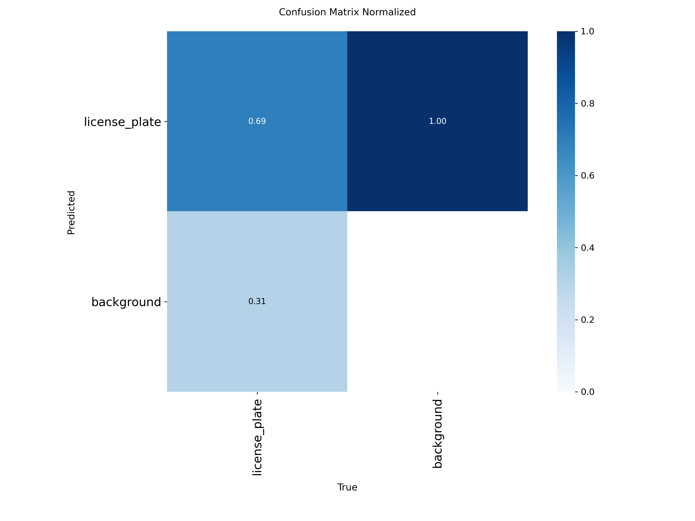
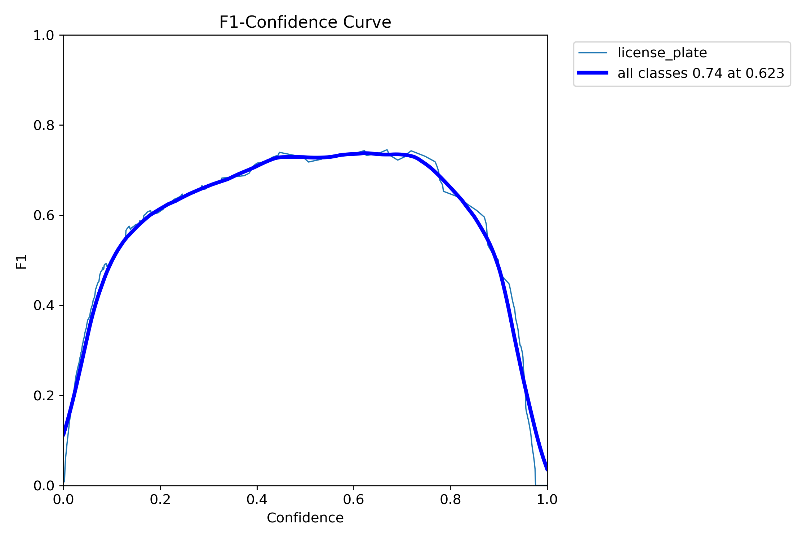

<div align="center">
  
</div>

<h1 align="center">Práctica 4</h1>

<div align="center" style="font-family: 'Segoe UI', sans-serif; line-height: 1.6; margin-top: 30px;">
  <h2 style="font-size: 28px; margin-bottom: 10px;">
    Asignatura: <span>Visión por Computador</span>
  </h2>
  <p style="font-size: 18px; margin: 4px 0;">
    Grado en Ingeniería Informática
  </p>
  <p style="font-size: 18px; margin-top: 10px;">
    Curso <strong>2025 / 2026</strong>
  </p>
</div>

<h2 align="center">Autores</h2>

- Asmae Ez Zaim Driouch
- Javier Castilla Moreno

<h2 align="center">Bibliotecas utilizadas</h2>

[](https://www.python.org/)
[](https://pytorch.org/)
[](https://huggingface.co/docs/transformers)
[](https://ultralytics.com/)
[](https://opencv.org/)
[](https://github.com/tesseract-ocr/tesseract)
[](https://github.com/JaidedAI/EasyOCR)
[](https://pandas.pydata.org/)
[](https://numpy.org/)
[](https://matplotlib.org/)
[](https://pillow.readthedocs.io/)

## Cómo usar
### Primer paso: clonar este repositorio
```bash
git clone "https://github.com/A-NullPointer/VC-P5-P5"
```
### Segundo paso: Activar tu environment e instalar dependencias
> [!NOTE]
> Todas las dependencias pueden verse en [este archivo](environment.yml). Si se desea, puede crearse un entorno de Conda con dicho archivo.

Si se opta por crear un nuevo `Conda environment` a partir del archivo expuesto, es necesario abrir el `Anaconda Prompt` y ejecutar lo siguiente:

```bash
conda env create -f environment.yml
```

Posteriormente, se activa el entorno:

```bash
conda activate VC_P4
```

### Tercer paso: ejecutar el cuaderno
Finalmente, abriendo nuestro IDE favorito y teniendo instalado todo lo necesario para poder ejecutar notebooks, se puede ejecutar los cuadernos de la práctica [Practica_4.ipynb](P4/practica_4.ipynb) y [Practica_4b.ipynb](P4/practica_4b.ipynb) seleccionando el environment anteriormente creado.

> [!IMPORTANT]
> Todos los bloques de código deben ejecutarse en orden, de lo contrario, podría ocasionar problemas durante la ejecución del cuaderno.

<h1 align="center">Tareas Práctica 4</h1>

Acceda al siguiente enlace para ver la implementación: [Practica_4.ipynb](P4/practica_4.ipynb)

<h2 align="center">Detección y conteo de personas y vehículos</h2>

Para esta parte de la práctica, se ha realizado la detección de las personas y vehículos en el vídeo proporcionado para tal haciendo uso del modelo YOLO nano. Además, se ha entrenado este modelo para que pueda detectar matrículas, siendo posteriormente leídas por algún procesador de texto como puede ser Pytesseract y SmolVLM en este caso.

Por otro lado, se ha usado un dataset de cosecha propia y en colaboración con otros compañeros de la asignatura para este entrenamiento, dicho dataset puede verse en la siguiente [carpeta de OneDrive del dataset](https://alumnosulpgc-my.sharepoint.com/:f:/g/personal/asmae_ez101_alu_ulpgc_es/Ek2-fbNk8aRNpZSvSVzkzyEBWOMvUt-M77A7Iz2TqO9N-w?e=7fcMNe).

Para etiquetar las imgánes del dataset, se ha usado las herramientas [makesense.ai](makesense.ai) y [LabelIMG](https://github.com/HumanSignal/labelImg). Finalmente, se han dispuesto las imágenes y las etiquetas siguiendo la siguiente estructura de carpetas:
- dataset
  - train
    - images
    - labels
  - val
    - images
    - labels

Una vez el dataset ha sido creado y etiquetado, se propone el siguiente código para realizar el entrenamiento usando YOLO:

```python
model = YOLO('yolo11n.pt')

model.train(
    data=r"C:\Users\asmae\Documents\INGENIERIA INFORMATICA\4 CUARTO\VC\Practicas\VC_P4&P5\dataset\data.yaml",
    epochs=100,
    imgsz=640,
    batch=16,
    name="license_plate_augmented",
    workers=2,       
    plots=False,
    patience=10,     
    augment=True,    
    mosaic=1,        
    mixup=0.5,       
    copy_paste=0.3,  
    auto_augment="randaugment"
)

metrics = model.val()
print(metrics)
```

Para este proyecto se optó por utilizar **YOLO11 Nano** en lugar del modelo Medium pues se observó  un claro problema de **overfitting**. El modelo Medium tiene muchos más parámetros que el necesario para aprender los patrones de nuestro dataset limitado por lo que tendía la **memorización** en lugar de aprender las características generales.

El modelo Nano resultó más adecuado para nuestro caso de uso.

Para el entrenamiento los parámetros clave han sido:

- **Workers = 2**: Para reducir el tiempo de espera de la GPU.
- **Batch = 16** 
- **Patience = 10**: Early Stopping
- **Augment = True**: Habilita las transformacione(Mosaic, Mixup, Copy-Pate y RandAugment)

Tras el entrenamiento se obtienen los siguientes resultados:

<h3 align="center">Matriz de Confusión Normalizada</h3> 

<div style="text-align: center;" align="center">  </div>

La matriz de confusión muestra el rendimiento del modelo clasificando las detecciones:

De todas las matrículas reales en el dataset, el modelo detecta correctamente el **69%**. El **31%** restante son **Falsos Positivos**: matrículas que el modelo  clasifica erróneamente como matrículas.

<h3 align="center">Curva F1-Confidence</h3> 

<div style="text-align: center;" align="center">  </div>

**Pico de rendimiento**: La curva alcanza su máximo (F1 ≈ 0.74) con un umbral de confianza de 0.623. Es el punto óptimo donde se maximiza el balance entre precisión y recal.

**Umbral bajo (<0.2)**: F1 baja debido a muchos falsos positivos.

**Umbral alto (>0.8)**: F1 cae porque se pierden muchas detecciones verdaderas (falsos negativos).


A continuación, tras haber entrenado un modelo capaz de detectar matrículas, se dispone a la generación de un vídeo donde se detectarán personas y vehículos con sus respectivas matrículas a partir del vídeo proporcionado para esta práctica. En dicha generación, se mostrará además en tiempo real el conteo de cada clase detectada.

El modo de proceder para detectar la matrícula ha sido detectar primero el vehículo, y a partir del recorte del fotograma donde se ha detectado, usar nuestro modelo entrenado para detectar la matrícula. De este modo, nos resulta algo más fácil la detección, a diferencia de si se tratase de detectar a partir de la totalidad del fotograma. Una vez detectada la matrícula, se le pasa a una función que la procesa para conseguir su texto con EasyOCR, PyTesseract o SmolVLM.

Tras todo esto, los resultados son anotados en un archivo csv para cada fotograma acorde al siguiente formato:

```
fotograma, tipo_objeto, confianza, identificador_tracking, x1, y1, x2, y2, matrícula_en_su_caso, confianza, mx1,my1,mx2,my2, texto_matricula
```

>  [!NOTE]
> Las columnas x1, y1, x2, y2 corresponden al bounding box de la detección. De igual manera, mx1, my1, mx2, my2 delimitan la detección de la matrícula en su caso.

A continuación, se muestran partes de los vídeos generados con las lecturas de matrículas usando EasyOCR y SmolVLM respectivamente:

<h3 align="center">Fragmento usando EasyOCR</h3> 

<div style="text-align: center;" align="center">  </div>

Puede ver el video completo en [carpeta de OneDrive imágenes recortadas](https://alumnosulpgc-my.sharepoint.com/:f:/g/personal/asmae_ez101_alu_ulpgc_es/Ek2-fbNk8aRNpZSvSVzkzyEBWOMvUt-M77A7Iz2TqO9N-w?e=7fcMNe).

<h3 align="center">Fragmento usando SmolVLM</h3> 

<div style="text-align: center;" align="center">  </div>

Como se puede osbervar en los fragmentos de vídeo mostrados, EasyOCR es pésimo haciendo la lectura de las matrículas, al igual que Pytesseract. Por otro lado, SmolVLM, aunque en algunos casos su lectura no era del todo correcta, funcionaba mucho mejor que los otros dos.

<h2 align="center">Práctica 4: Extras</h2>

En cuanto a los puntos extras, se han realizado dos de ellos; la anonimación de personas y el flujo de personas y vehículos.

Para la anonimación de personas, el modo de proseguir con este punto ha sido el usar una función desarrollada que aplica un blur a la detección de la persona o vehículo. Para esto, simplemente se aplica la función `cv2.GaussianBlur`.

El código para anonimizar es el siguiente:

```python
def anonimize(frame, *box):
    x1, y1,x2, y2 = box
    frame_copy = frame[y1:y2, x1:x2].copy()
    return cv2.GaussianBlur(frame_copy, (51,51), 15)
```

Se presenta un fragmento del vídeo resultante:

<h3 align="center">Fragmento anonimizando personas y matrículas</h3> 

<div style="text-align: center;" align="center">  </div>

En cuanto a la determinación del flujo, se ha definido un margen de varios píxeles en los bordes del vídeo para facilitar la detección de estos, pues se usan los boxes de detección de cada entidad para calcular hacia dónde se están moviendo y hacer el conteo de esta manera.

Se muestra el fragmento de código que realiza estas detecciones:

```python
        if track_id not in tracks:
            tracks[track_id] = {"tipo":tipo, "positions":deque(maxlen=10), "entered":False}
        tracks[track_id]["positions"].append((cx,cy))

        # Detectar si entra desde un borde
        if not tracks[track_id]["entered"]:
            if len(tracks[track_id]["positions"])>=min_frames_inside:
                first_x,first_y = tracks[track_id]["positions"][0]
                if first_x < margin: entry_counts[tipo]["izquierda"]+=1
                elif first_x > width-margin: entry_counts[tipo]["derecha"]+=1
                elif first_y < margin: entry_counts[tipo]["arriba"]+=1
                elif first_y > height-margin: entry_counts[tipo]["abajo"]+=1
                tracks[track_id]["entered"]=True

    # Detectar salidas
    for tid,data in list(tracks.items()):
        if tid not in current_ids and len(data["positions"])>0:
            cx,cy = data["positions"][-1]
            tipo=data["tipo"]
            if cx < margin: exit_counts[tipo]["izquierda"]+=1
            elif cx > width-margin: exit_counts[tipo]["derecha"]+=1
            elif cy < margin: exit_counts[tipo]["arriba"]+=1
            elif cy > height-margin: exit_counts[tipo]["abajo"]+=1
            del tracks[tid]
```

A continuación, se muestra un fragmento del vídeo resultado:

<h3 align="center">Fragmento determinando el flujo direccional</h3> 

<div style="text-align: center;" align="center">  </div>

<h1 align="center">Tareas Práctica 4b</h1>

Acceda al siguiente enlace para ver la implementación: [Practica_4b.ipynb](P4/practica_4b.ipynb)

Se realiza una comparación del rendimiento de diferentes métodos de reconocimiento óptico de caracteres.

1. Tesseract OCR - Motor OCR de código abierto desarrollado por Google.
2. SmolVLM - Modelo de lenguaje visual (Vision-Language Model).

<h3 align="center">Producción de las imágenes recortadas de las matrículas</h3>

Primero con un script de python y usando nuestro  modelo YOLO pre-entrenado se recorre el dataset y se detecta las matrículas automáticamente para recortarlas y guardar solo la región de la matrícula.

Cada imagen tiene como nombre los caracteres de su matrícula para usarlo más adelante para su verificación comparado con el resultado que nos alojan los modelos.

Los resultados generados se pueden ver en: [carpeta de OneDrive imágenes recortadas](https://alumnosulpgc-my.sharepoint.com/:f:/g/personal/asmae_ez101_alu_ulpgc_es/Ek2-fbNk8aRNpZSvSVzkzyEBWOMvUt-M77A7Iz2TqO9N-w?e=7fcMNe).

<h3 align="center">Comparativa</h3>

1. Tesseract:
La implementación utiliza PSM 7 que trata la imagen como una línea de texto única. Se utiliza además OEM 3 para reconocer solo caracteres alfanuméricos restrigiendose con Whitelist. El preprocesamiento se realiza mediante conversión de BGR a RGB.

```python
def ocr_tesseract(self, image_path):
        start_time = time.time()
        
        try:
            img = cv2.imread(str(image_path))
            
            if img is None:
                return None, 0
            
            img_rgb = cv2.cvtColor(img, cv2.COLOR_BGR2RGB)
            custom_config = r'--oem 3 --psm 7 -c tessedit_char_whitelist=ABCDEFGHIJKLMNOPQRSTUVWXYZ0123456789'
            
            text = pytesseract.image_to_string(img_rgb, config=custom_config)
            
            text = self.normalize_plate_text(text)
            
            elapsed_time = time.time() - start_time
            
            return text, elapsed_time
        
        except Exception as e:
            print(f"Error en Tesseract con {image_path.name}: {e}")
            return None, 0
```

2. SmolVLM:

Se utiliza float16 para optimización de memoria.

El **prompt** que se le pasa a este modelo multimodal es:
**"Extract the license plate number from this image. Return only the alphanumeric characters, no spaces or special characters."**

Todos los modelos aplican la misma función de normalización para garantizar comparaciones justas:

```python
def normalize_plate_text(text):
    text = text.upper().strip()
    text = re.sub(r'[^A-Z0-9]', '', text)
    return text
```

Esta función se crea para poder eliminare spacios en blanco, caracteres especiales y/o diferencias de mayúsculas/minúsculas.

Después del procesamiento se genera el CSV de salida con las siguientes columnas:

- image_name, -> Ejemplo: 0241JZP.jpg
- ground_truth, -> Se elimina la extención del tipo de imagen y se queda con solo el nombre que son los caracteres de la matricula -> Ejemplo: 0241JZP
- tesseract_output, 
- tesseract_time, 
- tesseract_exact_match, 
- tesseract_char_accuracy, 
- tesseract_levenshtein,
- smolvlm_output, 
- smolvlm_time, 
- smolvlm_exact_match, 
- smolvlm_char_accuracy, 
- smolvlm_levenshtein

Este CSV se emplea a continuación para calcular las diferentes métricas y poder realizar la comparación entre ambos modelos:

1. Coincidencia Exacta:

```python
exact_match = (predicted == ground_truth)
```

2. Porcentaje de caracteres correctos en la posición correcta

```python
matches = sum(1 for p, g in zip(pred, gt) if p == g)
char_accuracy = matches / max(len(pred), len(gt))
```

3. Levenshtein Distance
Calcula mínimo número de operaciones (inserción, eliminación, sustitución) para transformar s1 en s2

```python
def levenshtein_distance(s1, s2):
        if len(s1) < len(s2):
            return OCRComparator.levenshtein_distance(s2, s1)
        
        if len(s2) == 0:
            return len(s1)
        
        previous_row = range(len(s2) + 1)
        for i, c1 in enumerate(s1):
            current_row = [i + 1]
            for j, c2 in enumerate(s2):
                insertions = previous_row[j + 1] + 1
                deletions = current_row[j] + 1
                substitutions = previous_row[j] + (c1 != c2)
                current_row.append(min(insertions, deletions, substitutions))
            previous_row = current_row
        
        return previous_row[-1]
```

Así pues se extrae el ground truth del nombre del archivo (La matrícula), se ejecutan ambos modelos, se calcula las métricas para ambos modelos y se almacenan en el csv.

```python
def compare_ocr_methods(self, images_dir, output_csv="ocr_comparison_results.csv"):
    
        images_path = Path(images_dir)
        valid_extensions = {'.jpg', '.jpeg', '.png', '.bmp'}
        image_files = [
            f for f in images_path.iterdir() 
            if f.suffix.lower() in valid_extensions
        ]
        
        print(f"Encontradas {len(image_files)} imágenes en {images_dir}")
        print(f"Iniciando comparativa OCR...\n")
        print("=" * 80)
        
        results = []
        
        for idx, img_file in enumerate(image_files, 1):
            ground_truth = img_file.stem
            
            print(f"\n[{idx}/{len(image_files)}] Procesando: {img_file.name}")
            print(f"  Ground Truth: {ground_truth}")
            
            print("Tesseract...", end=" ")
            tess_text, tess_time = self.ocr_tesseract(img_file)
            tess_metrics = self.calculate_accuracy_metrics(tess_text, ground_truth)
            print(f"✓ ({tess_time:.3f}s) → {tess_text}")
            
            print("SmolVLM...", end=" ")
            smol_text, smol_time = self.ocr_smolvlm(img_file)
            smol_metrics = self.calculate_accuracy_metrics(smol_text, ground_truth)
            print(f"✓ ({smol_time:.3f}s) → {smol_text}")
            
            result = {
                'image_name': img_file.name,
                'ground_truth': ground_truth,
                
                'tesseract_output': tess_text or "",
                'tesseract_time': tess_time,
                'tesseract_exact_match': tess_metrics['exact_match'],
                'tesseract_char_accuracy': tess_metrics['char_accuracy'],
                'tesseract_levenshtein': tess_metrics['levenshtein_distance'],
                
                'smolvlm_output': smol_text or "",
                'smolvlm_time': smol_time,
                'smolvlm_exact_match': smol_metrics['exact_match'],
                'smolvlm_char_accuracy': smol_metrics['char_accuracy'],
                'smolvlm_levenshtein': smol_metrics['levenshtein_distance'],
            }
            
            results.append(result)
        
        df = pd.DataFrame(results)
        
        df.to_csv(output_csv, index=False, encoding='utf-8')
        print(f"\nResultados guardados en: {output_csv}")
        
        self.print_summary(df)
        
        return df
```

A continuación se generan los resultados:

<div align="center">
| Métrica | Tesseract | SmolVLM | Ganador |
|---------|-----------|---------|---------|
| **Aciertos Exactos** | 12/87 (13.8%) | 53/87 (60.9%) | **SmolVLM** (+41) |
| **Precisión Carácter** | 22.5% | 82.1% | **SmolVLM** |
| **Tiempo Promedio** | 0.287s | 27.730s | **Tesseract** (96.8x) |
| **Errores Levenshtein** | 3.4 | 0.9 | **SmolVLM** |
| **Throughput** | 303.5 img/s | 3.1 img/s | **Tesseract** |
<div>

Y se visualizan en gráficas para mejor comprensión:

<h3 align="center">Resultados de la comparación</h3> 

<div style="text-align: center;" align="center">  </div>

#### **SmolVLM: Precisión Superior pero extremadamente lento**

**60.9% de aciertos exactos** vs 13.8% de Tesseract. **82.1% de precisión por carácter** Incluso cuando no acierta completamente, está más cerca -> Levenshtein promedio de 0.9 (casi perfecto).

#### **Tesseract: Velocidad pero precisión nefasta**

Alta tasa de error -> Levenshtein de 3.4 (errores significativos) y Solo 22.5% de caracteres correctos en promedio.

<h1 align="center">Bibliografía</h3>

- [Repositorio usado como base y enunciado de esta práctica](https://github.com/otsedom/otsedom.github.io/tree/main/VC/P4)

